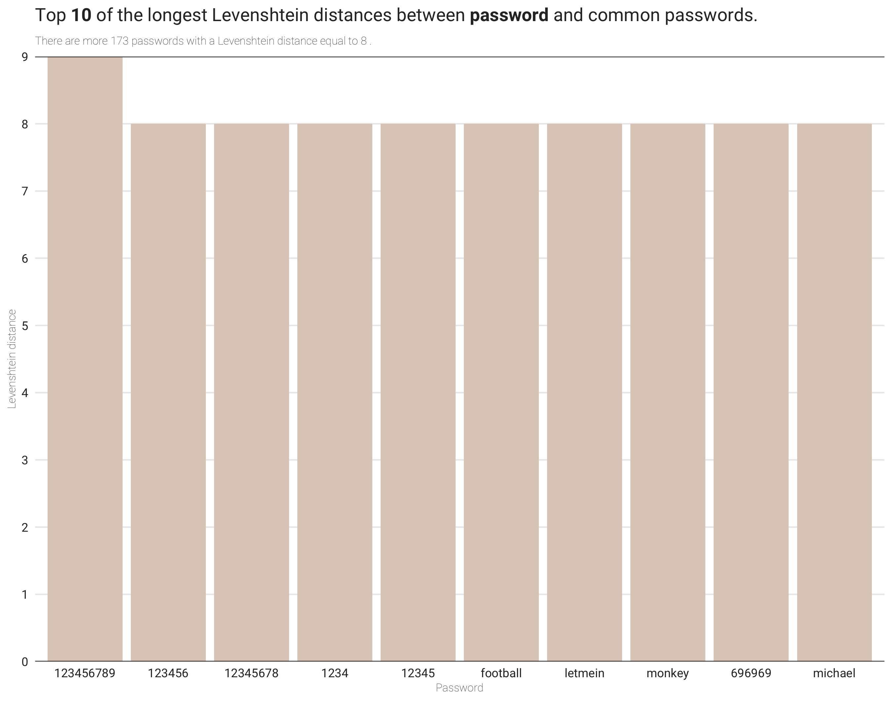

# #TidyTuesday

This repository contains my contributions to the [#TidyTuesday](https://github.com/rfordatascience/tidytuesday) project.

---

[`2019-12-31`](https://github.com/rfordatascience/tidytuesday/tree/master/data/2020/2020-01-14) | **Passwords** | [Code](passwords.R) | [Tweet](https://twitter.com/joaompalmeiro/status/1218347580163284992)

